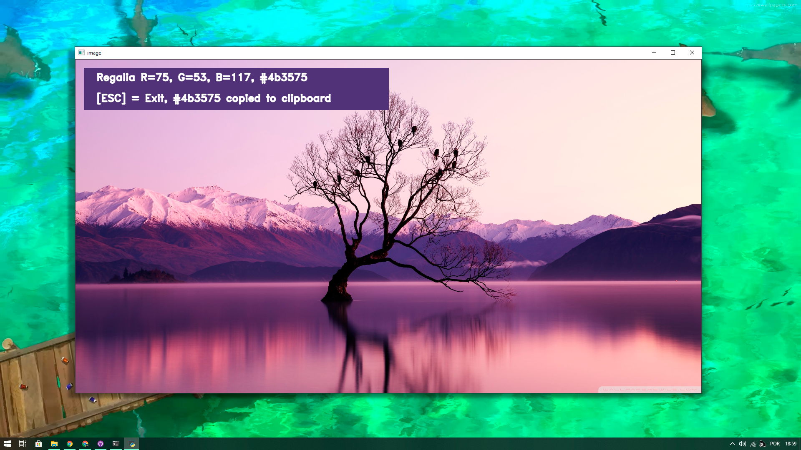

<h1 align="center">:art: Image Color Picker :dart:</h1>

<p align="center">
 <a href="https://www.linkedin.com/in/igor-gregori/">
    
  </a>
  <a href="https://github.com/Igor-Gregori/Color-Picker-Python/blob/main/LICENSE">
    
  </a>
  <a href="https://github.com/Igor-Gregori/Color-Picker-Python/issues">
    
  </a>
  <a href="https://github.com/Igor-Gregori/Color-Picker-Python/issues?q=is%3Aissue+is%3Aclosed">
    
  </a>
  <a href="https://github.com/Igor-Gregori/Color-Picker-Python/stargazers">
    
  </a>
  <a href="https://github.com/Igor-Gregori/Color-Picker-Python/network">
    
  </a>
</p>

<p align="center">
  <a href="#page_facing_up-descrição">Descrição</a>&nbsp;&nbsp;&nbsp;|&nbsp;&nbsp;&nbsp;
  <a href="#-tecnologias">Tecnologias</a>&nbsp;&nbsp;&nbsp;|&nbsp;&nbsp;&nbsp;
  <a href="#computer-instalação">Como usar</a>&nbsp;&nbsp;&nbsp;|&nbsp;&nbsp;&nbsp;
  <a href="#man-Desenvolvedor">Desenvolvedor</a>&nbsp;&nbsp;&nbsp;|&nbsp;&nbsp;&nbsp;
  <a href="#-licença">Licença</a>
</p>

<p align="center">
      
</p>

## :page_facing_up: Descrição

Color Picker é um projeto simples que utiliza bibliotecas básicas de ML, como o keras e o OpenCv

## ✨ Tecnologias

Esse projeto foi desenvolvido com as seguintes tecnologias:

- [Tkinter](https://docs.python.org/3/library/tkinter.html)
- [OpenCv](https://opencv.org/)
- [Pandas](https://pandas.pydata.org/)
- [EasyGui](http://easygui.sourceforge.net/)

## :computer: Como usar

### Pré-requisitos

Antes de começar, você vai precisar ter instalado em sua máquina as seguintes ferramentas:
[Git](https://git-scm.com), [Python](https://www.python.org/downloads/) recomendo a versão 3.9, Além disto é recomendado ter um editor para trabalhar com o código como o [PyCharm](https://www.jetbrains.com/pt-br/pycharm/download/#section=windows) ou o [VSCode](https://code.visualstudio.com/)

```bash
# Clone este repositório.
$ git clone https://github.com/Igor-Gregori/Color-Picker-Python

# Vá para a pasta moveit
$ cd Color-Picker-Python

# Instale as bibliotecas tk, cv2, easygui, pandas 
$ pip install "nome da biblioteca"

# Execute aplicação, selecione a imagem, leia o menu e seja feliz !
$ python3 main.py

# As cores vão automaticamente para seu clipboard
# Botão [ESC] para sair
```

## :man: Desenvolvedor

<a href="https://github.com/Igor-Gregori">
 
 <br />
 <sub><b>Igor Gregori</b></sub>
</a>

Desenvolvido por <b>Igor Gregori</b> :metal::satisfied::+1: Entre em contato! :speech_balloon:

<a href="https://www.linkedin.com/in/igor-gregori/">
  
</a>

## :closed_book: Licença

This project is [MIT](https://github.com/Igor-Gregori/Color-Picker-Python/blob/main/LICENSE) licensed.
